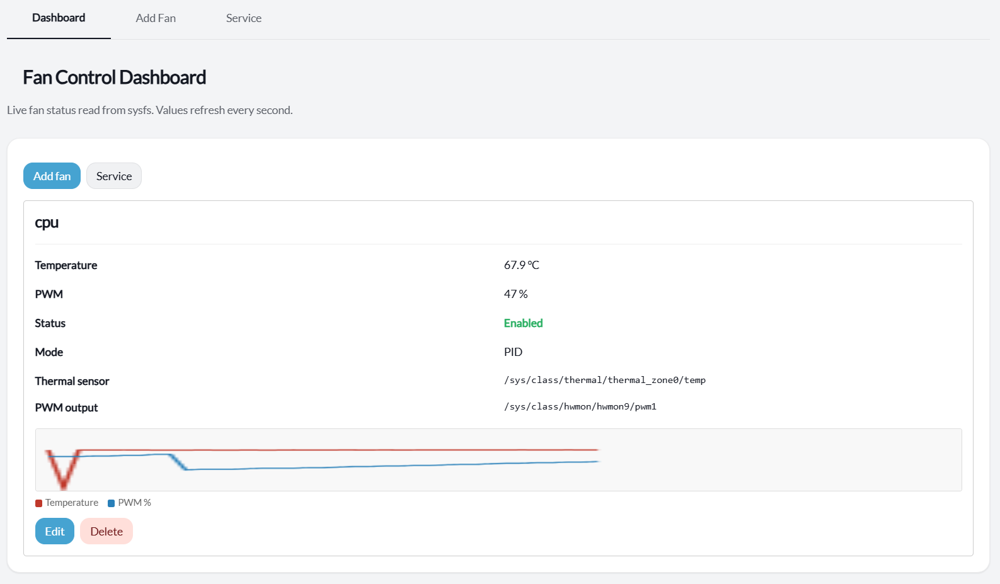
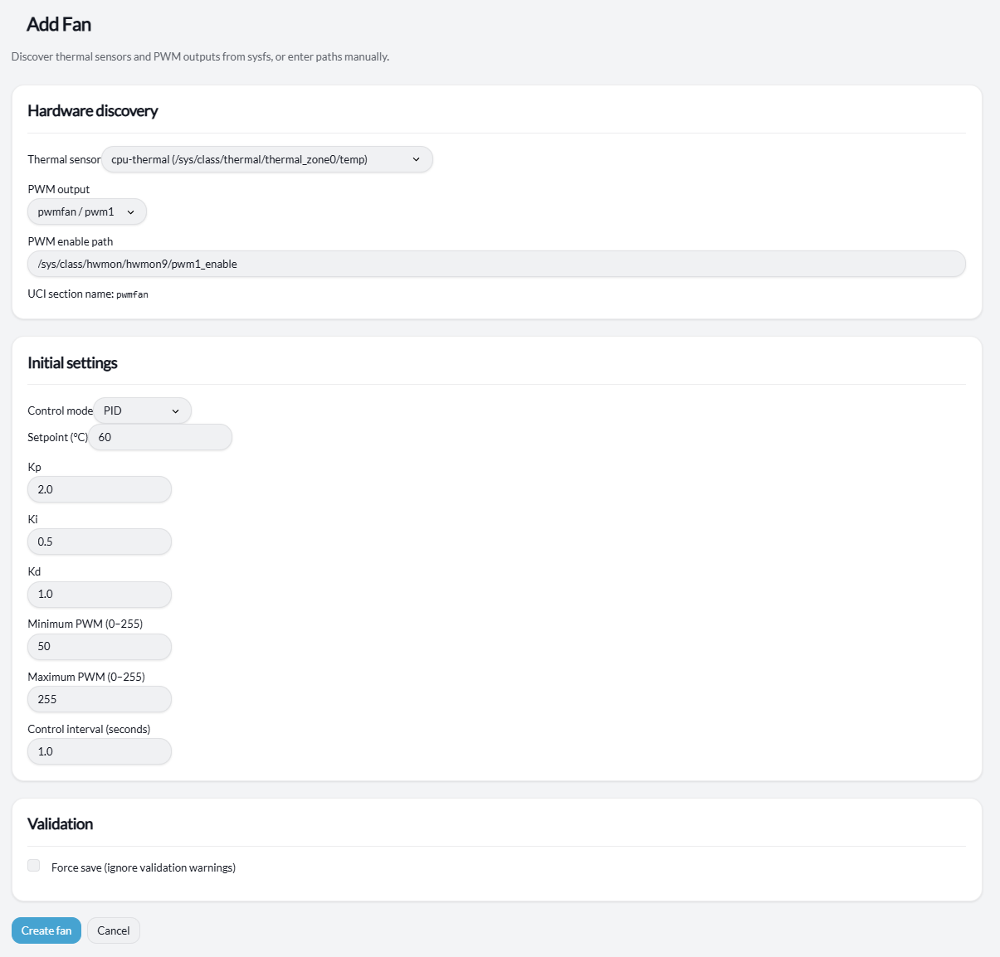
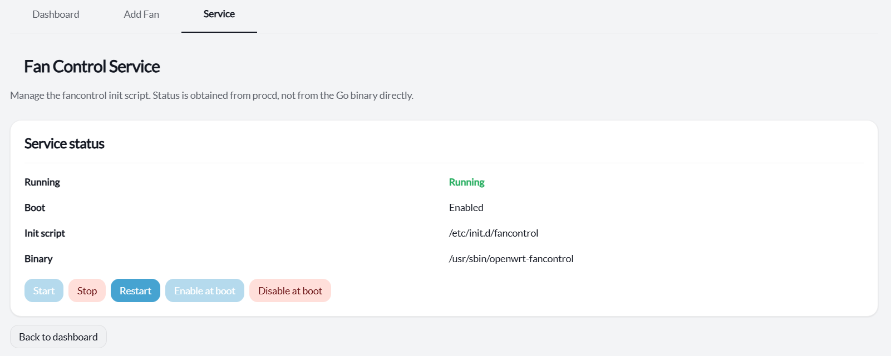

# LuCI FanControl

Web interface for [openwrt-fancontrol](https://github.com/shizzz/openwrt-fancontrol) on OpenWrt 24.x–25.x.

The daemon reads temperature from sysfs, adjusts PWM fan outputs using PID or fixed-speed control, and stores settings in UCI. LuCI lets you configure fans, watch live readings and charts, validate sysfs paths, and manage the service without editing config files by hand.

## Screenshots

**Dashboard** — live temperature, PWM, and rolling charts per fan (refreshed every second).



**Add Fan** — discovers thermal zones and PWM outputs under `/sys`, or accepts manual paths.



**Service** — start/stop/restart and boot enable/disable via procd.



## Install

Pre-built packages are published on each push to `develop` as the [`continuous`](https://github.com/shizzz/luci-app-fancontrol/releases/tag/continuous) pre-release. Tagged `v*` releases replace it once they appear.

Run on the router (auto-detects `opkg`/`.ipk` or `apk`/`.apk`):

```sh
wget -O /tmp/install-fancontrol.sh \
  https://raw.githubusercontent.com/shizzz/luci-app-fancontrol/develop/scripts/install-fancontrol.sh
sh /tmp/install-fancontrol.sh
```

The script resolves the latest `fancontrol` and `luci-app-fancontrol` packages for your architecture from GitHub releases, installs them, and enables the service.

- **opkg** — installs `.ipk` files with `opkg install`
- **apk** — installs `.apk` files with `apk add --allow-untrusted` (packages are not signed by the official feed)

After install, open **Services → Fan Control** in LuCI.

## Packages

| Package | Role |
|---------|------|
| `fancontrol` | Init script and architecture-specific daemon binary |
| `luci-app-fancontrol` | LuCI web UI (architecture-independent) |

## License

GPL-2.0-or-later
